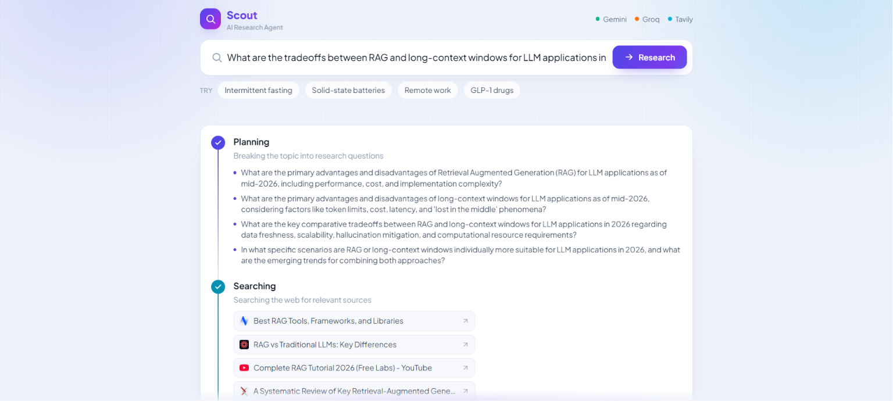
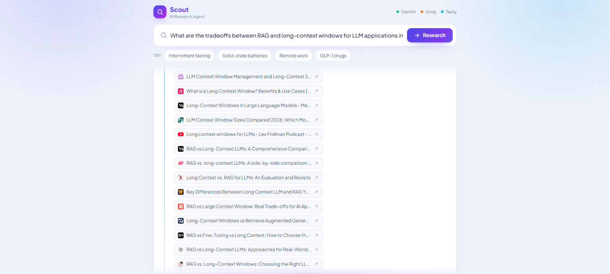
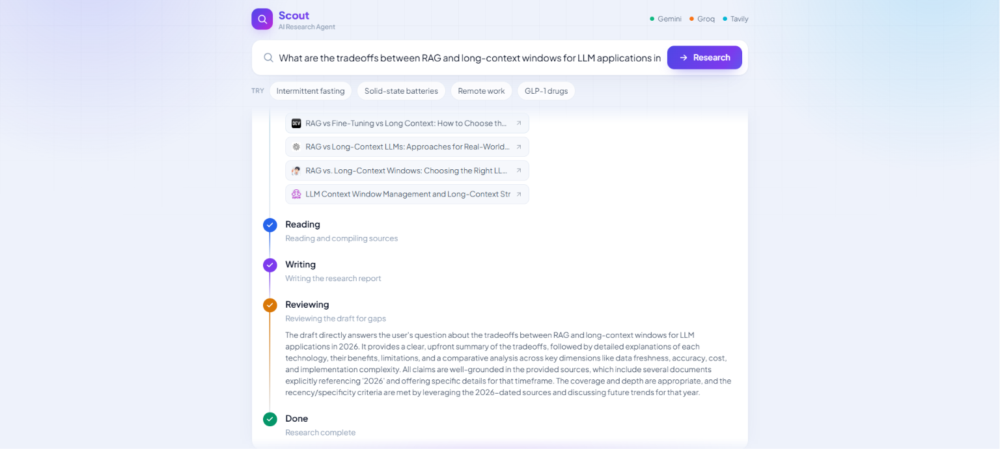
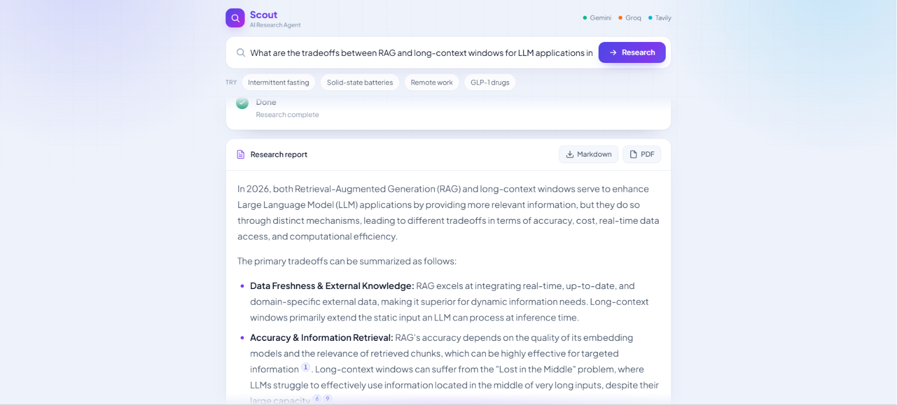
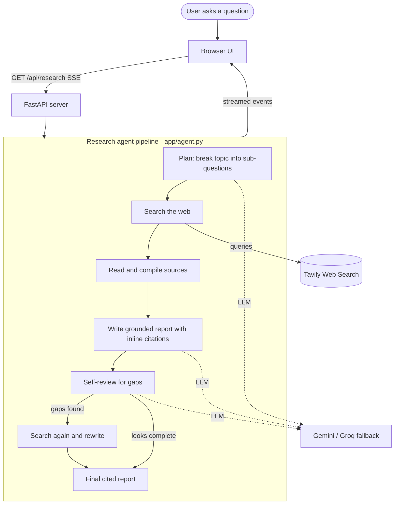

<div align="center">

# 🔬 Scout — AI Research Agent

**Give it a question. It plans, searches the web, reads sources, writes a fully-cited report — then reviews its own work and researches again to fill the gaps.**

[](https://www.python.org/)
[](https://fastapi.tiangolo.com/)
[](https://tavily.com/)
[](https://ai.google.dev/)
[](LICENSE)

### 🔗 [**Live Demo**](https://research-agent-8042.onrender.com) &nbsp;·&nbsp; a multi-step research agent with a live, watchable pipeline

</div>

---

## ✨ What it does

Most "AI" demos are a single model call dressed up. **Scout is a real agent** — it runs a multi-step pipeline and you watch every step happen live:

1. 🧭 **Plans** — breaks your question into focused web-search sub-questions.
2. 🔎 **Searches** — queries the live web (Tavily) and gathers real sources.
3. 📖 **Reads** — compiles the most relevant passages from each source.
4. ✍️ **Writes** — drafts a structured Markdown report grounded *only* in those sources, with inline `[n]` citations.
5. 🧐 **Reviews its own draft** — critiques coverage and flags unsupported claims or missing angles.
6. ♻️ **Self-corrects** — if it found gaps, it runs another targeted search round and rewrites a stronger report.

Then you get a clean, cited report you can **download as Markdown or PDF**.

- 🪜 **Live agent timeline** — every phase streams to the browser over Server-Sent Events, so you *see* the orchestration (plan → search → read → write → review → revise → done).
- 🧾 **Real citations** — each claim links to a real source URL; the sources list is rendered from what the agent actually used.
- 🔁 **Genuine self-correction** — the review step can trigger a second research round, not just a cosmetic pass.
- 🛡️ **Resilient on free tiers** — a multi-key Gemini → Groq fallback chain keeps it working even when a key hits its daily limit.
- 📥 **Export** — download the finished report as `.md` or `.pdf`.

> 🎬 **[Try the live demo →](https://research-agent-8042.onrender.com)** — ask it any research question and watch it work.

---

## 📸 Screenshots

> 🎬 See it in action on the **[live demo](https://research-agent-8042.onrender.com)**.

<table>
  <tr>
    <td width="50%"><br/><sub><b>Plans the investigation</b> — breaks your question into focused, searchable sub-questions.</sub></td>
    <td width="50%"><br/><sub><b>Searches the web</b> — queries Tavily and streams in real sources as it finds them.</sub></td>
  </tr>
  <tr>
    <td width="50%"><br/><sub><b>Reviews its own work</b> — critiques the draft for gaps and researches again if needed.</sub></td>
    <td width="50%"><br/><sub><b>Cited report</b> — a grounded answer with inline citations + sources, exportable as Markdown or PDF.</sub></td>
  </tr>
</table>

---

## 🏗️ Architecture



### How a question becomes a report
1. **Plan** — the LLM returns 3–5 focused search sub-questions as structured JSON (validated with Pydantic).
2. **Search** — each sub-question hits Tavily; results are de-duplicated into a numbered source set.
3. **Read** — the agent compiles a numbered context block from the source contents.
4. **Write** — the LLM drafts a Markdown report grounded *strictly* in the numbered sources, citing them inline as `[n]`.
5. **Review** — the LLM critiques its own draft and returns `{summary, needs_more, gaps}`.
6. **Revise (once)** — if `needs_more`, it searches the gap queries, adds new sources, and rewrites.
7. Every step is streamed to the browser as a Server-Sent Event, so the UI renders the pipeline in real time.

---

## 🧰 Tech stack

| Layer | Technology | Why |
|---|---|---|
| API / server | **FastAPI** + **Uvicorn** (async Python) | Clean async I/O and first-class streaming |
| Live updates | **Server-Sent Events** (`sse-starlette`) | Push each agent step to the browser as it happens |
| LLM orchestration | **OpenAI-compatible clients** over **Google Gemini** (2.5 Flash → Flash-Lite) with **Groq** (Llama 3.3 70B) fallback | Multi-key, multi-model failover so the demo never breaks on free-tier limits |
| Web search | **Tavily** | Agent-grade search that returns clean, readable content |
| Validation | **Pydantic v2** | Structured, type-safe agent outputs (plan + review) |
| Frontend | **Vanilla JS + Tailwind (CDN)**, `marked`, `html2pdf.js` | Zero build step; a polished, single-file UI |
| Hosting | **Render** (free tier) | One-file blueprint deploy, live public URL |

> **Provider-agnostic & resilient by design.** Every model call goes through one fallback chain in [`app/llm.py`](app/llm.py): each Gemini key is tried with `gemini-2.5-flash` then `gemini-2.5-flash-lite`, across every key, then **Groq** as a last resort. If one key hits its free-tier limit, the next takes over automatically.

---

## 🔑 Getting your free API keys

Everything below is **free** and needs **no credit card**.

### 1. Google Gemini — the report writer + planner + reviewer
1. Go to **https://aistudio.google.com/apikey** and sign in.
2. Click **Create API key → Create API key in new project**, then copy it.
3. *(Recommended)* Repeat with one or two other Google accounts and put all keys in `GOOGLE_API_KEYS`, comma-separated — more keys = more free headroom.

### 2. Groq — answer fallback (when all Gemini keys are busy)
1. Go to **https://console.groq.com/keys** and sign up (Google/GitHub login).
2. Click **Create API Key** and copy it (looks like `gsk_…`).

### 3. Tavily — the web-search engine
1. Go to **https://app.tavily.com** and sign up (free, no card).
2. Copy the API key from your dashboard (looks like `tvly-…`).

---

## 🚀 Run it locally

### Prerequisites
- Python 3.11+
- The three API keys above

### Setup
```bash
git clone <your-repo-url>
cd research-agent

python -m venv .venv
# Windows:
.venv\Scripts\activate
# macOS/Linux:
source .venv/bin/activate

pip install -r requirements.txt
cp .env.example .env.local   # then paste your keys into .env.local
```

`.env.local`:
```env
# One or more Gemini keys, comma-separated (tried in order, flash then flash-lite)
GOOGLE_API_KEYS=gemini_key_1,gemini_key_2
# Final fallback for the LLM when all Gemini keys are exhausted
GROQ_API_KEY=your_groq_key
# Web search
TAVILY_API_KEY=your_tavily_key
```

### Develop
```bash
uvicorn app.main:app --reload     # http://localhost:8000
```

---

## ☁️ Deploy to Render (free)

This repo ships a [`render.yaml`](render.yaml) blueprint, so deploying is one click:

1. Push this repo to GitHub.
2. Go to **https://dashboard.render.com** → **New → Blueprint**, and pick this repo.
3. Render reads `render.yaml` and creates the web service. Add your secrets when prompted: `GOOGLE_API_KEYS`, `GROQ_API_KEY`, `TAVILY_API_KEY`.
4. Deploy. Render gives you a live `https://….onrender.com` URL.

---

## 🎯 Skills demonstrated

- **Agentic orchestration** — a real multi-step pipeline (plan → search → read → write → review → revise) with genuine self-correction, not a single prompt.
- **Async Python services** — FastAPI + Uvicorn with streaming responses (Server-Sent Events).
- **LLM tool use & grounding** — web-search integration with strict source-grounded generation and inline citations to prevent hallucination.
- **Structured outputs** — Pydantic-validated JSON for the planner and reviewer steps.
- **Resilient system design** — multi-key, multi-provider failover that degrades gracefully on free-tier limits.
- **End-to-end product** — a polished streaming UI, export to Markdown/PDF, and a one-file cloud deploy.

---

## 📁 Project structure

```
research-agent/
├── app/
│   ├── main.py        # FastAPI app: SSE endpoint, static serving, health check
│   ├── agent.py       # the research pipeline (plan -> search -> write -> review -> revise)
│   ├── llm.py         # multi-key Gemini -> Groq fallback (OpenAI-compatible)
│   ├── search.py      # Tavily web search
│   ├── schemas.py     # Pydantic models for structured agent outputs
│   └── config.py      # environment / API-key loading
├── static/
│   ├── index.html     # single-page UI
│   ├── app.js         # SSE client, live timeline, report rendering, downloads
│   └── styles.css     # timeline, citations, and report styling
├── requirements.txt
├── render.yaml        # Render deploy blueprint
└── .env.example
```

---

## 📝 License

[MIT](LICENSE) — free to use, learn from, and build on.
